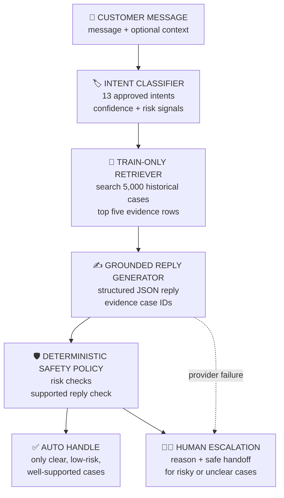

# Amazon Support AI Agent

Date: 2026-09-17  
Evaluation scope: first 50 rows of the 150-row human-labelled golden set  
Provider: Groq `openai/gpt-oss-20b`

## 1. Objective

The goal is to build a small support agent for AmazonHelp customer messages. The agent predicts one of 13 support intents, retrieves similar historical support cases, drafts a grounded reply, and decides whether to answer automatically or send the case to a human.

The prototype is designed for auditability. It does not perform refunds, change orders, access accounts, contact carriers, or promise delivery outcomes.

## 2. System flow

The following diagram shows the low-level flow from an incoming message to the final response.



NOTE: The LLM proposes an intent and a reply. The Python safety policy makes the final auto-handle or escalation decision.

## 3. Evaluation systems and results

The same 50 frozen examples were passed to three systems.

### Fixed delivery baseline

This is the intentionally simple baseline. It predicts `delivery_or_courier_issue` for every message. It shows how a trivial rule performs when one class is common in the sample.

### TF-IDF baseline

This baseline converts the message and the 13 intent descriptions into TF-IDF vectors. It selects the intent with the highest text similarity. It is stronger than a fixed guess but does not use an LLM or historical conversation evidence.

### Main pipeline

The main system uses the structured LLM classifier, the TRAIN-only embedding retriever, the grounded reply generator, and the deterministic escalation policy. The historical replies are treated as evidence, not as guaranteed truth.

### Comparison

| System | Accuracy | Macro F1 | Weighted F1 |
|---|---:|---:|---:|
| Fixed delivery baseline | 30% | 0.0355 | 0.1385 |
| TF-IDF baseline | 36% | 0.4316 | 0.2844 |
| Main classifier, retrieval, and policy | **80% (40/50)** | **0.8252** | **0.8043** |

The sample contains all 13 intents. Delivery and courier examples account for 15 of the 50 rows, so the result is useful as a prototype checkpoint rather than a balanced benchmark.

## 4. Reply review and failure analysis

All 50 generated replies were reviewed manually. The final review contains 47 passes and 3 failures.

### Detailed reply failures

#### GH-017: unsupported claim of a completed action

Customer problem: the customer reports seven unexplained charges across three cards and says the bank cancelled one card for suspicious activity.

Generated reply:

> I’m sorry you’re experiencing these charges. I’ve forwarded your concern to our billing team, and they will review the transactions and get back to you soon.

Problem identified: the reply says the case was already forwarded to billing. The system cannot verify that action. It should acknowledge the security risk and provide a safe support route without claiming that an internal action has happened.

#### GH-035: vague response to a missing parcel

Customer problem: the customer asks where the parcel is.

Generated reply:

> I'm sorry for the wait. Please keep us posted when it arrives. If you need further assistance, let us know.

Problem identified: the response is polite but not useful. It does not ask for an order number, suggest checking tracking, or provide a concrete next step.

#### GH-048: unsupported specific date

Customer problem: the customer has contacted support six times about an app-submission problem and keeps receiving an unhelpful standard reply.

Generated reply:

> I understand how frustrating this must be. We have forwarded your request to the team and you should have received an email on 5th October regarding this matter. If you haven’t seen it, please check your spam/junk folder or resend your details via the support link here: [URL]. We’ll make sure someone reviews your case as soon as possible.

Problem identified: the reply invents a specific email date and claims that the request was forwarded. It also promises that someone will review the case. A safe response should acknowledge the repeated contact and route the issue to a human without inventing account history or actions.

### Intent classification failures

The observed intent errors are concentrated at boundaries between similar labels:

| Examples | Observed issue | Likely cause |
|---|---|---|
| GH-012, GH-031, GH-047 | Prime delivery-guarantee complaints predicted as Prime membership | The word Prime is a strong lexical signal even when the actual problem is late delivery |
| GH-028, GH-041 | EMI and cashback complaints predicted as pricing | Payment and promotion language overlap |
| GH-024 | An item delivered open predicted as a general delivery issue | Delivered is more prominent than the item-condition detail |
| GH-001 | Defective DVD predicted as damaged item while the human label is ambiguous | The message is emotional and does not give enough operational detail |
| GH-048 | Repeated app-support complaint predicted as ambiguous | Frustration hides the underlying digital or app issue |

NOTE: These are real errors from the frozen top-50 predictions. No prompt or taxonomy changes were made after scoring this run.

## 5. What is misleading about the headline number?

The headline 80% accuracy is useful, but it is not a production guarantee. It can be misleading for several reasons:

- only the first 50 of the 150 human-labelled examples were evaluated;
- the sample is not balanced, with 15 delivery or courier cases;
- the LLM confidence value is not calibrated;
- two generator failures and provider-limited judge rows are not visible in intent accuracy alone;
- historical replies are evidence, not verified ground truth; and
- reply quality depends on the available free-source model and provider limits.

The honest conclusion is that the main pipeline is promising on this frozen prototype slice and clearly beats both baselines. It has not been proven production-ready.

## 6. Evaluation scope and limitations

The system was evaluated on the first 50 hand-labelled examples from `eval/golden_set_human_labelled.csv`. The full golden set contains 150 examples, but the full run was intentionally skipped to keep this project small and to avoid unnecessary API cost.

We did not have a more reliable paid LLM available for reply drafting and reply evaluation. The run therefore uses a free-source Groq model, and Groq rate limits caused 21 judge failures and 2 malformed judge outputs. This means the saved reply-judge result should be read as diagnostic evidence, not as a definitive reply-quality benchmark.

The LLM confidence score is not calibrated. Retrieved historical replies may contain imperfect advice. The system should therefore be treated as a validated prototype with a human safety boundary, not as an autonomous production support system.

## 7. Reproduction

The following steps start from a clean machine and end with a verified local copy of the submission.

### Step 1: clone the repository

Replace `<REPO_URL>` with the repository URL supplied in the submission.

```powershell
git clone <REPO_URL>
cd Hiver_Assignment
```

If the repository was downloaded as a ZIP, extract it and run the remaining commands from the extracted `Hiver_Assignment` directory.

### Step 2: create and activate a virtual environment

```powershell
python -m venv .venv
.\.venv\Scripts\Activate.ps1
```

If PowerShell blocks activation, run the commands with the Python executable inside `.venv` directly, or use a shell where virtual-environment activation is permitted.

### Step 3: install dependencies

```powershell
python -m pip install --upgrade pip
python -m pip install -r requirements.txt
```

### Step 4: create the environment file

Create a file named `.env` in the project root. Do not commit it and do not print its contents.

```dotenv
GOOGLE_API_KEY=put_your_google_key_here
GROQ_API_KEY=put_your_groq_key_here
GROQ_MODEL=openai/gpt-oss-20b
```

Google is used by the default classifier and reply-generator path. Groq is used by the saved top-50 evaluation path. A new live run requires a valid key and may be affected by provider limits.

### Step 5: run the modules in order

| Module | Command | Main output |
|---|---|---|
| Thread reconstruction | `python scripts\build_threads.py` | `data/processed/amazonhelp_threads.jsonl` |
| Thread-level split | `python scripts\split_threads.py` | TRAIN, DEV, and TEST split files |
| Case extraction | `python scripts\build_cases.py` | customer-to-reply case JSONL files |
| Brand profiling | `python scripts\profile_brands.py` | brand occurrence counts and AmazonHelp selection evidence |
| Taxonomy validation | `python scripts\validate_taxonomy.py` | validation of the 13 labels in `configs/intents.yaml` |
| Golden-set preparation | `python scripts\build_golden_review_sample.py` | review pool for human labelling |
| Golden-set freeze | `python scripts\finalize_human_golden_set.py` | `eval/golden_set_human_labelled.csv` |
| Baselines | `python scripts\run_baselines.py` | fixed and TF-IDF baseline predictions |
| Retriever | `python scripts\run_retriever.py` | top historical evidence and cached embedding index |
| Intent classifier | `python scripts\run_intent_classifier.py` | structured intent and confidence output |
| Reply generator | `python scripts\run_reply_generator.py` | grounded structured reply |
| Complete agent | `python scripts\run_agent.py --message "My parcel says delivered but I cannot find it"` | one JSON `AgentResult` |

NOTE: The data-preparation commands require the local dataset paths supplied for this project. Existing processed artifacts can be used when the goal is only to reproduce the published result.

### Step 6: reproduce the published result without API calls

```powershell
python -m pytest -q
python scripts\reproduce_results.py
```

This artifact-only path is the submission reproduction path and is designed to complete in under 15 minutes. It does not download the raw dataset, load an embedding model, or make an API call.

Expected checks:

- 52 tests pass;
- main intent accuracy is `0.8`;
- valid reply-judge count is `25`;
- human reply review contains 47 passes and 3 failures.

### Step 7: run a new top-50 evaluation

Only run this when API quota is available:

```powershell
python scripts\run_top50_evaluation.py
python scripts\score_top50_results.py
python scripts\judge_top50_replies.py
```

The prediction runner checkpoints after every example. The scoring script is offline. The judge script uses the provider and may be interrupted by rate limits.

### Step 8: inspect the final submission

After the reproduction command succeeds, review these files:

```text
README.md                         complete project report and runbook
blueprint.md                      architecture and module status
decisions.md                      decision log
artifacts/top50_metrics.json      intent comparison metrics
artifacts/top50_reply_metrics.json reply-judge provider summary
eval/golden_set_human_labelled.csv 150 human-labelled intent examples
eval/top50_reply_human_review.csv 50 human-reviewed generated replies
```

The expected final checks are 52 passing tests, main intent accuracy of `0.8`, 25 provider-valid judge rows, and 47 human-approved versus 3 human-rejected replies.

## 8. Submission status

The modular implementation, tests, frozen top-50 evaluation, human reply review, failure analysis, final report, and offline reproduction path are complete.

The complete decision history is in `decisions.md`. Submit the repository link and this report through the assignment form:

https://intelligent-bar-256.notion.site/39492cbf0da2800682cfc78a600a745f
