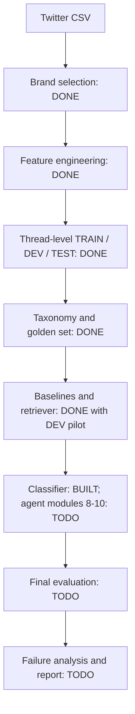
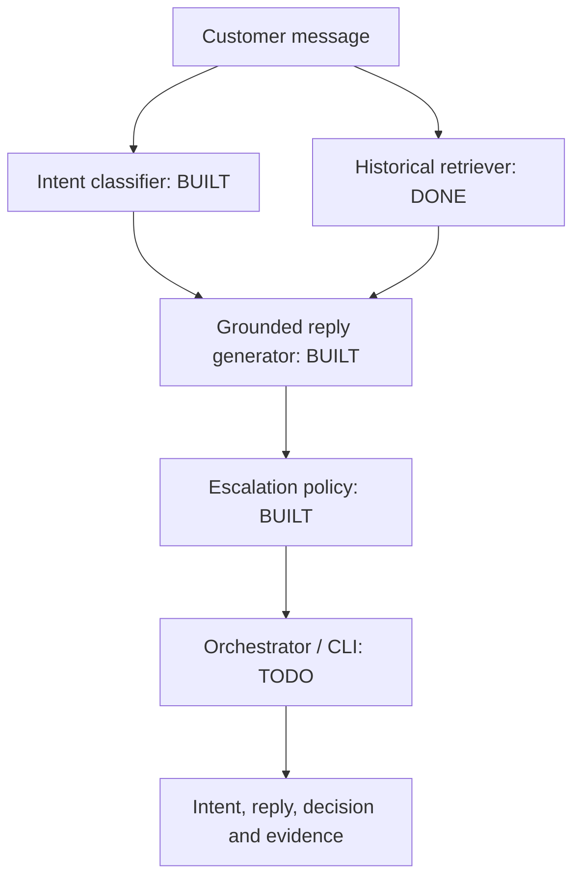

# Hiver SDE Intern Assignment - Project Blueprint

> Status (2026-09-17): Modules 1-10 are implemented. A reproducible Groq-backed top-50 run completed for Module 11: intent accuracy is 80% (40/50), and all 50 generated replies now have human pass/fail review. Module 12 reporting and offline reproduction are complete. The full 150-case run, judge-agreement analysis, escalation labels, and Module 0 reproducible setup remain intentionally open.

## 1. What, Why, and How

### What are we building?

We will build an AI customer-support agent for **one brand** in the Customer Support on Twitter dataset.

For each incoming customer message, the agent must:

1. classify the message into a small, data-derived intent;
2. draft a reply grounded in similar historical conversations from the same brand; and
3. decide whether to `AUTO_HANDLE` the message or `ESCALATE` it to a human, with a clear reason.

The final response contract will be simple and auditable:

```json
{
  "intent": "example_intent",
  "intent_confidence": 0.87,
  "reply": "A concise, grounded support reply.",
  "decision": "AUTO_HANDLE",
  "decision_reason": "Strong intent confidence and relevant historical evidence.",
  "evidence": [
    {
      "case_id": "case_123",
      "similarity": 0.82
    }
  ]
}
```

### Why are we building it this way?

The assignment says that **proof is worth more than the system**. A convincing submission therefore needs more than a plausible chatbot. It must show:

- what the agent can do well;
- what it cannot safely do;
- how it compares with simpler systems;
- why the reported metrics can be trusted; and
- when a human should take over.

### How will we build it?

We will work one module at a time. Every module will have its own inputs, outputs, tests, evaluation, and approval gate. Only after a module passes its gate will it be connected to the orchestrator.

The core strategy is:

```text
understand data -> define evaluation -> build baselines -> build agent
-> calibrate escalation -> run final test once -> analyze failures -> report
```

---

## 2. Source of Truth and Working Rules

When instructions disagree, use this order:

1. `Hiver SDE Intern Assignment.docx` - assignment requirements;
2. `AGENTS.md` - how we plan, explain, implement, and test;
3. this `blueprint.md` - the agreed project plan;
4. code comments and temporary notes.

The assignment requires:

- one brand from Customer Support on Twitter;
- a small intent set derived from that brand's data;
- historically grounded replies;
- an auditable auto-handle/escalate decision;
- a 150-250 example hand-labelled golden set;
- automated metrics plus an LLM-as-judge rubric;
- evidence of human agreement with the LLM judge;
- at least two baselines: one trivial and one simple;
- top five failure modes with real examples and hypotheses;
- a mandatory section explaining what is misleading about the headline number;
- a 10-15 item decision log; and
- a public or shared repository whose headline results reproduce in under 15 minutes.

Final submission goes through the assignment form:

```text
https://intelligent-bar-256.notion.site/39492cbf0da2800682cfc78a600a745f
```

### Module working agreement

For every module, we will follow the same conversation and engineering cycle:

1. **Learn:** explain the module's WHAT, WHY, and HOW in plain language.
2. **Plan:** name the files, interfaces, tests, metrics, assumptions, and choices.
3. **Approve:** ask for user input only for a decision that materially changes scope, cost, safety, or results.
4. **Implement:** write the smallest code that satisfies the approved plan.
5. **Verify:** run unit tests and the module's evaluation command.
6. **Report:** show exact commands, results, limitations, and files changed.
7. **Checkpoint:** write a short handoff summary before moving to the next module.

No later module may be used to hide a failure in an earlier one.

---

## 3. Confirmed Local Data

### Primary dataset: Customer Support on Twitter

```text
C:\Users\mrina\Downloads\Hiver_Assignment\twitter_dataset\twcs\twcs.csv
```

Observed file size: about 516 MB.

Observed columns:

```text
tweet_id
author_id
inbound
created_at
text
response_tweet_id
in_response_to_tweet_id
```

This is the only dataset we will use for:

- choosing the brand;
- deriving the final brand-specific taxonomy;
- historical response retrieval;
- reply generation evidence;
- the hand-labelled golden set; and
- the final headline results.

**Selected brand (2026-09-14): `AmazonHelp`.** It ranked first with 169,840 outbound tweets, 168,814 verified replies, and 154,976 distinct customer messages replied to. The evidence and rationale are recorded in `decisions.md`.

### Secondary dataset: Banking77

```text
C:\Users\mrina\.cache\huggingface\hub\datasets--PolyAI--banking77\snapshots\90d4e2ee5521c04fc1488f065b8b083658768c57
```

The snapshot contains the Banking77 loader, metadata, and label definitions. The dataset describes 13,083 English banking queries across 77 labelled intents.

The assignment permits Banking77 **for intent work only**. We will therefore use it, if useful, as an isolated diagnostic to prove that the intent-classification and metric code work on a known labelled dataset.

Banking77 will **not** be used to:

- choose the Twitter brand;
- define a non-banking brand's final intent taxonomy;
- retrieve support replies;
- provide response evidence;
- populate the golden set; or
- calculate the final Twitter-agent headline number.

This boundary prevents domain leakage and keeps the submission faithful to the assignment.

### Data handling rules

- Do not commit the 516 MB raw CSV.
- Store raw paths in local configuration or environment variables, never in core logic.
- Commit only small processed samples and evaluation artifacts that are needed for reproduction.
- Mask customer handles, URLs, emails, phone numbers, and obvious account identifiers in committed examples.
- Preserve original tweet and thread IDs only where needed for leakage checks and traceability.

---

## 4. System Flowcharts

`DONE` means implemented and checked at its current stage; `BUILT` means implemented but not through its quality gate; `TODO` means not yet implemented. A `DONE` pilot is not a final evaluation result.

### 4.1 Offline data and evaluation flow



Feature engineering here includes linking tweets into conversations, extracting customer-to-brand reply cases, masking text for review, and applying the English-candidate guard. Whole threads are then split by time, so one conversation cannot appear in multiple splits. The final 150-row golden set is now human-reviewed; the earlier proposal file and previous frozen snapshot are retained as audit history.

### 4.2 Online agent flow



The retriever is implemented and has only a small assistant-judged DEV pilot. The classifier has unit tests, a synthetic live API check, and a 19-case assistant-labelled DEV pilot; its accuracy is not independently verified. The reply generator and escalation policy are built and tested; the orchestrator has not been built.

### 4.3 Optional Banking77 boundary

Banking77 remains an optional, separate intent-pipeline diagnostic. Its data does not feed the Twitter support agent or final results.

### 4.4 Progress at a glance

| Module | Status | What remains |
|---|---|---|
| 0 - Setup/data access | Incomplete | Reproducible environment, loader and repository checks |
| 1 - Brand selection | Done | AmazonHelp selected from measured counts |
| 2 - Feature engineering and splits | Done | Review English-filter edge cases if used in evaluation |
| 3 - Intent taxonomy | Done | 13 approved labels, including appreciation |
| 4 - Golden set | Done for intent labels | Add/verify escalation and expected-resolution labels before final scoring |
| 5 - Baselines | Done with caveat | Score on frozen golden set in Module 11; DEV smoke test is not accuracy |
| 6 - Retriever | Done with caveat | Pilot is assistant-judged, not independent final evidence |
| 7 - Intent classifier | Built; gate pending | Review the 19 provisional DEV labels; pilot beats both baselines but is not independent gold |
| 8 - Reply generator | Built; quality gate pending | Grounded drafting and reply-quality evaluation |
| 9 - Escalation policy | Built; calibration pending | Deterministic rules and 12 synthetic safety fixtures pass; real safety labels still needed for metrics |
| 10 - Orchestrator / CLI | Built; smoke-tested | Connect tested modules; live synthetic example completed; final evaluation remains |
| 11 - Final evaluation | Top-50 run complete; judge agreement intentionally skipped | Groq run scored intent predictions; reply judge had 21 rate-limit and 2 format failures; all 50 replies have human review labels |
| 12 - Report/reproduction | Complete for top-50 scope | Failure analysis, final report, artifact-only reproduction, and test verification complete |

---

## 5. Proposed Repository Structure

The structure is modular but intentionally small:

```text
Hiver_Assignment/
|-- README.md
|-- blueprint.md
|-- pyproject.toml
|-- .env.example
|-- .gitignore
|-- configs/
|   |-- paths.example.yaml
|   |-- brand.yaml
|   |-- intents.yaml
|   `-- evaluation.yaml
|-- data/
|   |-- README.md
|   |-- processed/              # ignored except tiny samples
|   `-- samples/                # safe, small committed examples
|-- src/
|   `-- support_agent/
|       |-- schemas.py
|       |-- data_loader.py
|       |-- brand_profiler.py
|       |-- thread_builder.py
|       |-- data_splitter.py
|       |-- intent_discovery.py
|       |-- intent_classifier.py
|       |-- retriever.py
|       |-- reply_generator.py
|       |-- escalation_policy.py
|       |-- baselines.py
|       |-- evaluator.py
|       |-- orchestrator.py
|       `-- cli.py
|-- tests/
|   |-- fixtures/
|   |-- test_data_loader.py
|   |-- test_brand_profiler.py
|   |-- test_thread_builder.py
|   |-- test_data_splitter.py
|   |-- test_intent_classifier.py
|   |-- test_retriever.py
|   |-- test_reply_generator.py
|   |-- test_escalation_policy.py
|   |-- test_baselines.py
|   |-- test_evaluator.py
|   `-- test_orchestrator.py
|-- eval/
|   |-- annotation_guide.md
|   |-- golden_set.csv             # previous batch-approved snapshot
|   |-- golden_set_human_labelled.csv # current human-reviewed intent snapshot
|   |-- retrieval_benchmark.csv
|   |-- judge_rubric.md
|   `-- human_scores.csv
|-- artifacts/
|   |-- predictions/
|   |-- judge_scores/
|   |-- metrics/
|   `-- figures/
|-- reports/
|   |-- final_report.md
|   `-- decision_log.md
`-- scripts/
    |-- profile_data.py
    |-- prepare_data.py
    |-- discover_intents.py
    |-- build_golden_set.py
    |-- build_index.py
    |-- run_agent.py
    |-- run_evaluation.py
    `-- reproduce_results.py
```

Why this shape:

- each important behavior has one obvious module;
- each module has a matching test file;
- scripts are thin entrypoints, not duplicate business logic;
- `orchestrator.py` wires already-tested modules together; and
- data, evaluation labels, predictions, and reports remain visibly separate.

We should not add more folders or abstractions unless a real need appears.

---

## 6. Recommended Tech Stack

Use a small, explainable Python stack:

| Need | Recommended tool | Why |
|---|---|---|
| Language | Python 3.11 or 3.12 | Broad ML-library compatibility |
| Tables | pandas + PyArrow | Familiar CSV processing and compact Parquet output |
| Classical baseline | scikit-learn | TF-IDF, cosine similarity, metrics |
| Embeddings | sentence-transformers | Local semantic embeddings |
| Vector search | scikit-learn NearestNeighbors | Enough for a sampled corpus; simpler than a vector database |
| Validation | Pydantic | Strict, readable input/output contracts |
| LLM | One provider selected later | Avoid committing to cost or credentials before approval |
| Tests | pytest | Small unit and integration tests |
| RAG evaluation | DeepEval where it adds value | Contextual precision/recall and groundedness diagnostics |
| Statistics/plots | scipy + matplotlib/seaborn | Agreement metrics, confidence intervals, figures |

The current shell resolves Python 3.13. Module 0 must verify dependency compatibility and create a reproducible Python 3.11/3.12 environment if the required ML packages do not support the installed interpreter cleanly.

### Simplicity decisions

- No frontend is required; a CLI demo is enough.
- No LangChain/LangGraph is needed for a linear pipeline.
- No FAISS/vector database is needed until measured retrieval latency demands it.
- No fine-tuning is planned.
- No Docker, database, Redis, cloud deployment, or multi-agent runtime is planned.
- No paid call is required to reproduce already-published headline metrics.

The LLM provider and exact model are a later human decision because they affect cost, latency, and reproducibility.

---

## 7. Shared Data Contracts

Defining contracts early lets modules be tested independently.

```python
class SupportCase(BaseModel):
    case_id: str
    thread_id: str
    customer_text: str
    context: list[str]
    brand_reply: str | None
    created_at: datetime


class IntentPrediction(BaseModel):
    intent: str
    confidence: float
    reason: str


class RetrievedCase(BaseModel):
    case_id: str
    customer_text: str
    brand_reply: str
    similarity: float


class GeneratedReply(BaseModel):
    reply: str
    evidence_case_ids: list[str]
    grounded: bool
    uncertainty_reason: str | None


class EscalationDecision(BaseModel):
    action: Literal["AUTO_HANDLE", "ESCALATE"]
    reason_code: str
    reason: str


class AgentResult(BaseModel):
    intent: IntentPrediction
    reply: GeneratedReply
    decision: EscalationDecision
    evidence: list[RetrievedCase]
```

Exact fields can change during module planning, but changes must be documented because downstream tests depend on them.

---

## 8. Module-by-Module Implementation Plan

### Module 0 - Project Setup and Data Access

**Implementation status (2026-09-16):** Incomplete. The current scripts work locally, but the reproducible environment, shared loader, and repository checks in this module are not finished.

**Files:** `pyproject.toml`, `.gitignore`, `configs/paths.example.yaml`, `data_loader.py`

**What:** Establish the reproducible project environment and create the smallest safe loader for the Twitter CSV and optional Banking77 source.

**Why:** Every later result is unreliable if paths, columns, datatypes, or row limits are inconsistent.

**How:**

- read paths from a local configuration/environment variable;
- initialize version control and ignore raw data, secrets, caches, and generated indexes;
- pin only the dependencies we actually use;
- validate required Twitter columns;
- support `nrows`/chunked reads for fast development;
- normalize tweet IDs as strings; and
- expose Banking77 through a separate optional loader.

**Tests:** clean import, missing columns, row limit, ID datatype, deterministic sample, missing path message, and raw-data/secret ignore checks.

**Gate:** loader tests pass and a small sample loads without reading the full file into memory.

**Deliverable:** reproducible environment instructions plus a dataset inventory containing paths, sizes, schemas, and load timings.

### Module 1 - Brand Profiling and Selection

**Implementation status (2026-09-16):** Complete. Measured profiling selected `AmazonHelp`; see `decisions.md` for counts and rationale.

**File:** `brand_profiler.py`

**What:** Measure which brands have enough clean, useful conversations.

**Why:** Choosing a brand by intuition could leave us with noisy threads, too little data, or an unmanageably broad domain.

**How:** profile a small shortlist such as SpotifyCares, AppleSupport, Uber_Support, AmazonHelp, and one data-driven high-volume candidate. Measure:

- inbound and outbound message counts;
- connected conversation count;
- median messages per thread;
- percentage of threads with a brand reply;
- single-turn versus multi-turn share;
- duplicate/near-duplicate rate; and
- a small manual quality sample.

**Tests:** counts on a synthetic mini-dataset, correct inbound/outbound logic, deterministic ranking.

**Gate - human decision:** present the comparison table and 10-20 sample threads. The user approves one brand before we continue.

**Acceptance:** selected brand has enough usable cases for train/dev/test and a 150-250 item golden set.

### Module 2 - Thread Reconstruction, Cleaning, and Leakage-Safe Splits

**Implementation status (2026-09-15):** Thread reconstruction, chronological thread-level splitting, readable thread viewing, and direct customer-to-reply case extraction are complete. The verified result contains 82,534 threads and 374,042 messages with zero cross-split overlap. A conservative English-candidate guard is used only for the review pool; human review remains authoritative.

**Files:** `thread_builder.py`, `data_splitter.py`

**What:** Rebuild conversations using tweet links, clean them, and split entire threads by time.

**Why:** Row order is not conversation order. Splitting individual tweets can leak the answer or related messages into the retrieval index.

**How:**

- treat each `tweet_id` as a node;
- use `in_response_to_tweet_id` as the parent edge;
- use `response_tweet_id` only as supporting child information;
- reconstruct connected threads and sort by timestamp;
- create support cases from customer message -> useful brand reply;
- remove exact duplicates and flag near-duplicates;
- mask PII in exportable text; and
- split complete threads chronologically, initially 70% TRAIN / 15% DEV / 15% TEST.

Only TRAIN may enter the retrieval index. DEV is for choices and thresholds. TEST examples may be sampled and hand-labelled early so the evaluation contract is fixed, but TEST labels and system performance must not be used for model, prompt, retrieval, or threshold choices.

**Tests:** branched thread, missing parent, multiple response IDs, chronological ordering, deduplication, PII masking, and pairwise-disjoint thread IDs.

**Gate:** zero overlapping thread IDs across splits and zero TEST IDs in the retrieval corpus.

**Deliverables:** processed Parquet files plus a data-quality report.

### Module 3 - Intent Discovery and Taxonomy

**Implementation status (2026-09-16):** Complete. A TRAIN-only clustering diagnostic had silhouette score `-0.044264`, so it was not used to assign labels automatically. The user completed the 20-example pilot, which exposed a distinct appreciation class. The approved taxonomy contains 13 intents, with `customer_appreciation` added as label 13 without renumbering labels 1-12.

**Files:** `intent_discovery.py`, `configs/intents.yaml`

**What:** Derive a small, brand-specific intent set from TRAIN messages.

**Why:** The assignment requires intents defined from the data, not copied from Banking77 or invented in advance.

**How:**

1. draw a seeded, diverse TRAIN sample;
2. embed and cluster it only as a discovery aid;
3. inspect representative and boundary examples;
4. propose roughly 8-12 user-understandable intents;
5. write descriptions, include/exclude rules, and examples;
6. retain `other_or_ambiguous`; and
7. revise until two people can apply the guide consistently.

**Optional Banking77 diagnostic:** run the intent evaluation code on Banking77's known 77 labels to detect broken classifier/metric wiring. Report it separately as a diagnostic, never as a Twitter-agent result.

**Tests:** taxonomy schema, valid unique labels, classifier cannot return an unknown label, deterministic sample.

**Gate - human decision:** review examples for every label and approve the final taxonomy before golden-set labelling.

**Acceptance:** every intent has a clear definition, positive examples, exclusions, and an escalation note.

### Module 4 - Annotation Guide and Golden Evaluation Set

**Implementation status (2026-09-16):** The user reviewed the assistant proposal file and corrected eight intent numbers. `eval/golden_set_human_labelled.csv` is now the current 150-row human-reviewed intent snapshot; `eval/golden_set.csv` and the proposal file remain as audit history. All 13 intents appear, but 66/150 cases concern delivery/couriers and label 10 has just one example, so rare-class metrics will be unstable. Escalation and expected-resolution labels are still not present.

**Files:** `eval/annotation_guide.md`, `eval/golden_set_human_labelled.csv`

**What:** Build 180-200 hand-labelled examples from the held-out TEST pool.

**Why:** This is the main evidence used to judge the agent. A weak or biased golden set makes every metric misleading.

**How:** use a reproducible mixed sample:

- about 60% representative/random cases;
- about 25% intent-balanced or long-tail cases; and
- about 15% difficult cases: ambiguity, multi-intent, anger, missing context, security/payment risk, or unusual wording.

Suggested fields:

```text
example_id
tweet_id
thread_id
created_at
customer_text
context
gold_intent
gold_should_escalate
gold_escalation_reason
expected_resolution
risk_tags
ambiguous
annotator_notes
```

The label is an expected action/resolution, not one exact reply sentence.

**Human process:** AI may organize examples and flag inconsistencies, but a human must make or explicitly verify the final labels. Double-review a stratified subset and record disagreements.

**Tests:** schema completeness, allowed labels, no duplicate IDs, no TRAIN/DEV overlap, reproducible sample IDs, valid escalation values.

**Gate:** 150-250 valid, hand-verified records and a clear sampling/annotation note. Freeze the labels and do not run development comparisons against them.

### Module 5 - Two Required Baselines

**Implementation status (2026-09-16):** `baselines.py` now has a fixed-delivery baseline and a TF-IDF similarity baseline. Both return a safe escalation reply. The similarity baseline fits a seeded 5,000-case TRAIN sample, compares messages with the 13 taxonomy definitions, and exposes one historical TRAIN reply for reviewer inspection only. A 10-case DEV smoke test ran, but no accuracy or F1 is reported because DEV intent labels do not exist. The observed wrong guesses are documented limitations, not hidden successes.

**File:** `baselines.py`

**What:** Build one trivial system and one simple non-LLM system.

**Why:** We need to prove that complexity creates measurable value.

**Trivial baseline:**

- predicts the most common TRAIN intent;
- returns one generic safe reply; and
- escalates every message.

**Simple baseline:**

- intent: TF-IDF similarity to intent definitions/examples;
- reply: nearest TRAIN customer message's historical brand reply; and
- decision: auto-handle only above a DEV-tuned similarity threshold.

**Tests:** deterministic outputs, TRAIN-only fitting, stable threshold boundary, no external API calls.

**Gate:** both baselines produce the same `AgentResult` schema as the main system and run correctly on DEV.

**Acceptance:** baseline implementations and DEV results are frozen before main-system optimization. Their final golden-set predictions are generated later, together with the main system, in Module 11.

### Module 6 - Historical Retriever

**Implementation status (2026-09-16):** Implemented in `retriever.py` with a seeded 5,000-case TRAIN pool, cached local sentence embeddings, and in-memory cosine ranking. No vector database or intent filter. The top-five result includes case IDs, customer messages, historical replies, and similarity scores; replies remain evidence only. A 15-query, assistant-judged DEV pilot favored embeddings over TF-IDF (Precision@1 0.667 vs 0.133; Precision@5 0.587 vs 0.213), but is not independent ground truth or a final TEST result. The 5,000-case index build took 377 seconds; a cached repeat query took about 20 seconds including model startup.

**File:** `retriever.py`

**What:** Find the most relevant historical cases from the selected brand's TRAIN split.

**Why:** The reply must be grounded in evidence, not only in an LLM's general knowledge.

**How:**

- embed the seeded TRAIN customer-message sample locally;
- rank its vectors directly by cosine similarity in memory;
- retrieve a small top-k, initially `k=5`;
- return similarity plus the historical customer/reply pair; and
- never search DEV or TEST cases.

**Retrieval evaluation:** select about 25 DEV queries and judge the combined top-five candidates from TF-IDF and embedding retrieval. Keep this DEV-only; do not use the frozen TEST set to choose the retriever.

Report:

- Precision@1 and Precision@5;
- pooled Recall@5; and
- latency per query.

We will call recall **pooled recall** because exhaustively labelling every relevant case in the full corpus is unrealistic.

**Tests:** known-match retrieval, sort order, top-k size, empty query handling, no split leakage, reproducible index metadata.

**Gate:** retrieval quality improves on the TF-IDF baseline on the judged DEV queries, or we keep TF-IDF and avoid unnecessary model complexity. Leakage tests must pass either way.

### Module 7 - Intent Classifier

**Implementation status (2026-09-16):** Implemented in `intent_classifier.py` with the approved 13-label taxonomy, Google Gen AI structured output, and strict local validation. Four classifier unit tests and one synthetic live API check passed; the full suite now passes 31 tests. On a fixed 19-case, assistant-labelled DEV pilot, it matched 15 labels (78.9%) versus TF-IDF's 7 (36.8%) and the fixed baseline's 6 (31.6%). See `eval/intent_dev_pilot_review.md` and `artifacts/intent_dev_pilot_results.json`. Four classifier disagreements had reported confidence 0.85-0.95, so confidence is not calibrated. Human verification of the DEV labels is still needed; this is not final or independently verified accuracy. The module's quality gate remains open.

**File:** `intent_classifier.py`

**What:** Predict one approved intent, confidence, and short reason.

**Why:** Intent guides retrieval, failure analysis, and escalation.

**How:** use the fixed taxonomy, a small number of examples, low-temperature structured output, and Pydantic validation. Confidence is a signal to calibrate, not a fact to trust blindly.

**Tests:** one fixture per intent, ambiguous examples, malformed model output, unknown labels, retry/failure behavior.

**Metrics:** accuracy, macro F1, weighted F1, per-intent precision/recall/F1, confusion matrix, and confidence calibration on DEV.

**Gate:** outperform both baseline intent classifiers on DEV, with no unsupported labels and documented weak classes.

### Module 8 - Grounded Reply Generator

**Implementation status (2026-09-16):** Built in `reply_generator.py`. It requests structured JSON from Gemini, cites only retrieved case IDs, returns a safe handoff when there is no evidence, and locally flags unsupported refund/account/timeline commitments. Five unit tests and one synthetic live API smoke test passed; the full suite passes 41 tests. This validates formatting and safety gates, not final reply quality. DEV reply judging remains for Module 11.

**File:** `reply_generator.py`

**What:** Draft a short brand-appropriate answer using retrieved evidence.

**Why:** A fluent answer is not enough; it must be supported and safe.

**How:** the prompt must prohibit unsupported claims about refunds, account actions, compensation, timelines, policies, and technical facts. It must cite evidence case IDs internally and flag insufficient evidence.

The generator may draft an escalated handoff reply, but it does not make the final decision.

**Tests:** structured output, evidence IDs exist, insufficient-evidence fixture, no-evidence fixture, prohibited account-action claims.

**Evaluation:** DeepEval groundedness/context-use metrics plus the project judge rubric defined in Module 11.

**Gate:** no critical unsupported claim in the fixed safety fixtures and improved DEV reply quality over the simple baseline.

### Module 9 - Deterministic Escalation Policy

**Implementation status (2026-09-16):** Built in `escalation_policy.py`. It is deterministic and conservative: payment/refund/account-security topics, ambiguity, low confidence, weak/no evidence, missing context, risk tags, and unsupported replies escalate. Only clear low-risk supported cases with strong evidence can auto-handle. The explicit prompt instructions are exported for the future reply generator. Twelve synthetic safety fixtures and five policy tests pass. This validates rule behavior, not real-world escalation accuracy; a small human safety set remains optional before reporting escalation metrics.

**File:** `escalation_policy.py`

**What:** Decide `AUTO_HANDLE` or `ESCALATE` from auditable rules and calibrated signals.

**Why:** An LLM should not be the only authority deciding whether its own answer is safe.

**How:** auto-handle only when all required checks pass:

```text
intent confidence is high enough
AND retrieval evidence is strong enough
AND the message is not ambiguous or multi-intent
AND no high-risk rule is triggered
AND the generator reports sufficient support
AND no unsupported-claim signal is present
```

Possible hard-escalation categories, finalized from selected-brand data:

- account security or unauthorized access;
- payment/refund disputes;
- personal/account information requests;
- legal or physical safety threats;
- unsupported policy questions;
- multiple unrelated issues;
- unknown/ambiguous intent; and
- insufficient conversation context.

Use stable reason codes such as `LOW_RETRIEVAL_CONFIDENCE`, `HIGH_RISK_TOPIC`, and `AMBIGUOUS_INTENT`.

**Tests:** every hard rule, just-above/below threshold boundaries, combined signals, stable reason codes.

**Metrics:** escalation precision/recall/F1, automation coverage, unsafe auto-handle rate, and auto-handled reply pass rate.

**Gate:** choose thresholds on DEV using a coverage-versus-safety curve, record them in configuration, then freeze them.

### Module 10 - Orchestrator and CLI

**Implementation status (2026-09-16):** Built in `orchestrator.py` and `cli.py`. The orchestrator sequences classifier → retriever → reply generator → deterministic escalation policy and returns one validated `AgentResult`. Four end-to-end mocked tests and CLI help verification passed; the full suite passes 45 tests. One live synthetic parcel example completed through the CLI: the classifier chose `delivered_not_received`, the generator cited TRAIN evidence but marked support insufficient, and the policy correctly returned `ESCALATE` with `UNSUPPORTED_REPLY`.

**Files:** `orchestrator.py`, `cli.py`

**What:** Wire the tested modules into one runnable pipeline.

**Why:** Independent modules become useful only when their contracts work together.

**How:**

```python
def handle_message(message: str, context: list[str] | None = None) -> AgentResult:
    normalized = normalize(message, context)
    intent = classifier.predict(normalized)
    evidence = retriever.search(normalized, intent, k=5)
    draft = generator.generate(normalized, intent, evidence)
    decision = escalation_policy.decide(normalized, intent, evidence, draft)
    return AgentResult(intent=intent, reply=draft, decision=decision, evidence=evidence)
```

The orchestrator contains sequencing only. Business logic remains in its module.

**Tests:** end-to-end fixtures for auto-handle, escalate, model failure, empty evidence, and deterministic replay with mocked LLM responses.

**Gate:** one CLI command returns valid JSON and exposes its evidence and decision reason.

### Module 11 - Evaluation Harness and Judge Validation

**Implementation status (2026-09-17):** Built in `evaluator.py`, with the top-50 runner in `scripts/run_top50_evaluation.py`, the reply judge in `scripts/judge_top50_replies.py`, and offline artifact reproduction in `scripts/reproduce_results.py`. The first 50 rows of `eval/golden_set_human_labelled.csv` were run with Groq `openai/gpt-oss-20b`; the main intent pipeline achieved 40/50 accuracy (80%), macro F1 `0.8252`, and weighted F1 `0.8043`. The fixed baseline scored 30% and TF-IDF scored 36%. Reply judging attempted all 50 rows, but only 25 provider-valid rows remain after excluding 21 rate-limit failures, 2 malformed judge responses, and 2 generator failures. All 50 replies now have human review labels: 47 pass and 3 fail. The full 150-case run and judge-agreement analysis were intentionally skipped by project decision.

**File:** `evaluator.py`

**What:** Run all three systems on the same golden examples, save raw outputs, calculate metrics, and validate the LLM judge.

**Why:** This is the proof layer of the assignment.

**How:** freeze every prediction before aggregating metrics. The judge scores each reply from 1-5 on:

- relevance;
- groundedness;
- helpfulness/actionability;
- brand/support tone;
- unsupported-claim safety; and
- escalation appropriateness.

A reply fails automatically if it contains a critical unsupported claim, even if its average score is high.

Human validation procedure:

1. sample about 50 outputs across all systems, intents, and difficulty levels;
2. hide LLM-judge scores from the human reviewer;
3. use the exact same rubric;
4. compare ordinal scores with Spearman correlation;
5. compare pass/fail with Cohen's kappa and raw agreement; and
6. report disagreements, not only the headline agreement number.

**Tests:** metric values on hand-calculated fixtures, no division-by-zero errors, prediction/gold ID alignment, stable seeded sample.

**Gate:** every headline number can be recomputed from committed/frozen artifacts without an API call.

### Module 12 - Failure Analysis, Report, and Reproduction

**Files:** `reports/final_report.md`, `reports/decision_log.md`, `scripts/reproduce_results.py`

**What:** Turn results into a reviewer-friendly six-page report or concise README section.

**Why:** The reviewer must understand both the system's value and its limits quickly.

**How:** include:

- problem framing and what "good" means for the selected brand;
- what we intentionally did not build;
- result table for trivial, simple, and main systems;
- five highest-frequency or highest-risk failure modes with real examples;
- judge-versus-human agreement;
- the mandatory "What is misleading about my headline number?" section;
- what we would do with one more week; and
- the 10-15 decision log.

**Tests:** clean-environment install, artifact integrity checks, and a timed reproduction run.

**Gate:** a reviewer can reproduce headline tables/figures in under 15 minutes and run one live demo separately.

---

## 9. Evaluation Design

### 9.1 Data split and leakage prevention

Use complete threads, not individual rows:

```text
oldest 70% of threads -> TRAIN: discovery, fitting, retrieval corpus
next 15%             -> DEV: thresholds, prompts, model choices
newest 15%           -> TEST: golden-set candidate pool and final evaluation
```

Required automated assertions:

```python
assert train_threads.isdisjoint(dev_threads)
assert train_threads.isdisjoint(test_threads)
assert dev_threads.isdisjoint(test_threads)
assert not retrieved_case_ids.intersection(test_case_ids)
```

Near-duplicate checks must also run across splits, because different thread IDs can still contain nearly identical text.

### 9.2 Systems compared

| System | Intent | Reply | Escalation |
|---|---|---|---|
| Trivial | Most common label | Generic safe response | Always escalate |
| Simple | TF-IDF prototype similarity | Nearest historical reply | Similarity threshold |
| Main | Structured LLM classifier | Semantic retrieval + grounded generation | Deterministic calibrated policy |

All systems receive exactly the same golden examples.

### 9.3 Metrics

| Area | Primary metrics | Why |
|---|---|---|
| Intent | Macro F1, accuracy, per-intent F1 | Macro F1 exposes weak rare classes |
| Retrieval | Precision@k, pooled Recall@k, MRR/nDCG | Measures evidence relevance |
| Reply | Judge pass rate, critical-error rate | Measures useful and safe responses |
| Judge reliability | Cohen's kappa, Spearman, agreement | Tests whether the automatic judge is credible |
| Escalation | F1, coverage, unsafe auto-handle rate | Prevents "escalate everything" from looking good |
| End-to-end | Correct intent + acceptable reply + correct decision | Measures the complete task |

The strongest support-agent headline should have this form:

> At X% automation coverage, Y% of auto-handled replies passed the quality and safety rubric, with Z% unsafe auto-handling.

X, Y, and Z must come from frozen TEST results. They must never be chosen in advance.

### 9.4 Threshold calibration

On DEV only, sweep intent and retrieval thresholds and plot:

```text
automation coverage vs. auto-handled reply quality/safety
```

Select and freeze one operating point before running final TEST evaluation. Do not repeatedly modify the system after viewing TEST results.

### 9.5 Confidence intervals

For important TEST proportions, calculate bootstrap 95% confidence intervals. A golden set of roughly 200 examples is useful but still small, especially for rare intents.

---

## 10. Reproducibility Plan

Separate two reviewer paths.

### Path A - reproduce published results without API cost

```powershell
python scripts/reproduce_results.py
```

This loads frozen predictions, human labels, judge outputs, and configuration; recomputes metrics; and regenerates result tables/figures. Target runtime: well under 15 minutes.

### Path B - rerun the live pipeline

```powershell
python scripts/run_agent.py --message "example customer message"
python scripts/run_evaluation.py --live
```

This path may require an API key and will be documented separately from result reproduction.

Every prediction artifact should record:

```text
system name
model name
prompt version/hash
temperature
retrieval index version
threshold configuration
seed
timestamp
code commit hash
```

---

## 11. Human Decision Gates

We should stop and ask for approval only at decisions with real consequences:

1. **Brand selection:** based on profiling results and sample threads.
2. **Intent taxonomy:** based on discovered clusters and boundary examples.
3. **LLM/model choice:** based on price, latency, privacy, and available credentials.
4. **Golden labels:** human verification before the set is frozen.
5. **Automation operating point:** explicit coverage-versus-safety tradeoff.
6. **Final TEST run:** confirm that prompts, thresholds, and taxonomy are frozen.
7. **Publication:** secret scan, license/citation check, repository visibility, and final push.

Routine implementation and reversible tests do not need repeated approval.

---

## 12. Milestones and Stop Conditions

| Milestone | Modules | Evidence required before continuing |
|---|---|---|
| M1: trustworthy data | 0-2 | Brand approved, reconstructed threads, leakage tests pass |
| M2: trustworthy labels | 3-4 | Taxonomy approved, annotation guide complete, 150-250 verified labels |
| M3: credible floor | 5 | Both baselines run and frozen metrics exist |
| M4: working components | 6-9 | Retriever, classifier, generator, and policy pass their own gates |
| M5: working agent | 10 | End-to-end CLI returns auditable structured output |
| M6: trustworthy proof | 11 | Final metrics and human/judge agreement reproducible |
| M7: submission-ready | 12 | Report complete and clean reproduction is under 15 minutes |

If a gate fails, we fix that module before adding the next one.

### Checkpoint report after every module

```text
Module:
What was built:
Why it exists:
Files changed:
Tests run:
Measured results:
Known limitations:
Decision needed, if any:
Next module:
```

This report is also the compact handoff summary before the next module begins.

---

## 13. Required Final Results Table

Do not enter numbers until the frozen evaluation is complete.

| Metric | Trivial | Simple | Main |
|---|---:|---:|---:|
| Intent accuracy | TBD | TBD | TBD |
| Intent macro F1 | TBD | TBD | TBD |
| Reply judge pass rate | TBD | TBD | TBD |
| Critical unsupported-claim rate | TBD | TBD | TBD |
| Escalation F1 | TBD | TBD | TBD |
| Automation coverage | 0% | TBD | TBD |
| Unsafe auto-handle rate | 0% | TBD | TBD |
| Auto-handled reply pass rate | N/A | TBD | TBD |
| End-to-end success rate | TBD | TBD | TBD |

Judge-validation table:

| Measure | Value |
|---|---:|
| Human/judge Spearman correlation | TBD |
| Human/judge Cohen's kappa | TBD |
| Human/judge pass/fail agreement | TBD |

---

## 14. Planned Failure Analysis

We must not invent the final five failure modes before seeing the results. After the frozen TEST run, group actual failures and select the five most frequent or most dangerous.

Likely investigation categories include:

- ambiguous or multi-intent messages;
- semantically similar retrieval with the wrong resolution;
- missing conversation context;
- rare or unseen issue;
- unsupported or overconfident claims;
- right tone but unhelpful next step; and
- correct answer with an incorrect escalation decision.

For each chosen failure mode, report:

```text
frequency
real masked customer example
gold label/expected action
retrieved evidence
system output
why it failed
hypothesis
specific next fix
```

---

## 15. What May Be Misleading About the Headline Number

The final report must discuss, at minimum:

- the golden set is only 150-250 examples;
- rare-intent estimates will have wide uncertainty;
- the dataset is historical and brand policies may have changed;
- historical replies show prior behavior but are not perfect ground truth;
- the LLM judge is imperfect even after human validation;
- high quality can be inflated by low automation coverage;
- a partly intent-balanced test set does not match natural production traffic;
- time splitting reduces but does not remove semantic duplicates;
- escalation labels involve human judgement; and
- reply scores are proxies because real customer resolution/satisfaction is unavailable.

This section strengthens the submission by showing honest engineering judgement.

---

## 16. Initial Decision Log

These are planned decisions. Final entries must be updated with evidence as modules finish.

1. Use one brand because support style and policies differ across brands.
2. Profile candidates before selecting the brand.
3. Keep Banking77 restricted to optional intent diagnostics.
4. Split entire threads by time before indexing to prevent leakage.
5. Derive roughly 8-12 brand intents from TRAIN data.
6. Use a mixed golden-set sample instead of only clean random examples.
7. Compare against both trivial and TF-IDF baselines.
8. Start semantic search with local embeddings and `NearestNeighbors`.
9. Keep escalation deterministic and auditable.
10. Tune choices on DEV and run frozen TEST once.
11. Treat critical unsupported claims as automatic reply failures.
12. Validate LLM-judge ratings against hidden human ratings.
13. Report automation coverage beside quality and safety.
14. Freeze raw predictions and judge outputs for cheap reproduction.
15. Exclude UI, deployment, fine-tuning, and multi-agent orchestration from the core scope.

---

## 17. Definition of Done

The project is submission-ready only when every box is true:

```text
[x] One brand was selected from measured profiling evidence
[x] Conversation threads were reconstructed and tested
[x] TRAIN/DEV/TEST are thread-level, time-based, and leakage-safe
[x] Final intents were derived from TRAIN data and documented
[ ] Golden set contains 150-250 hand-verified TEST examples
[ ] Trivial baseline is implemented and evaluated
[ ] Simple baseline is implemented and evaluated
[x] Retriever has preliminary DEV Precision@k and pooled Recall@k evidence
[ ] Main agent returns intent, grounded reply, evidence, and decision reason
[ ] Deterministic escalation rules and thresholds are tested
[ ] Intent, reply, escalation, and end-to-end metrics are computed
[ ] LLM judge is compared against about 50 blinded human ratings
[ ] Top five real failure modes are documented
[ ] Misleading-headline-number section is honest and complete
[ ] Decision log contains 10-15 evidence-backed decisions
[ ] Frozen artifacts reproduce headline results without paid API calls
[ ] README reproduction completes in under 15 minutes
[ ] Code can run one live example separately
[ ] Raw data and credentials are not committed
[ ] Borrowed datasets, tools, prompts, and ideas are cited
[ ] Repository and report are ready for the required submission form
```

---

## 18. Immediate Next Step

The top-50 checkpoint is complete for the requested scope. The final package is `reports/final_report.md`, with evidence in `artifacts/top50_metrics.json`, `artifacts/top50_reply_metrics.json`, and `eval/top50_reply_human_review.csv`. Module 7's DEV-label caveat, Module 8/9 quality gates, the intentionally skipped full-150/judge-agreement work, and Module 0's reproducibility setup remain explicit; describe this as a validated prototype, not a production-ready system.
